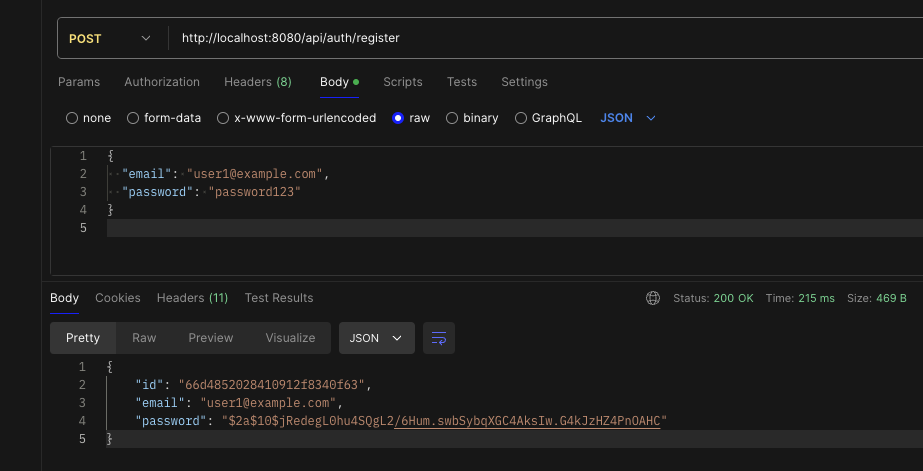
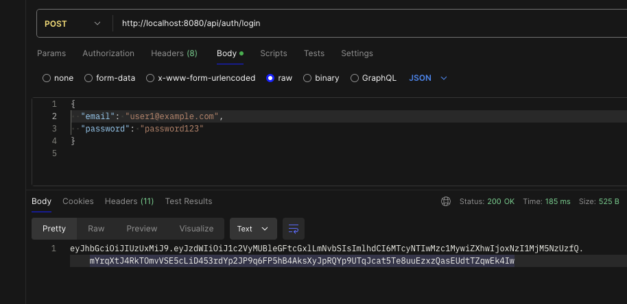

# Spring Boot JWT Authentication

This project is a Spring Boot application that demonstrates how to implement JWT-based authentication. The application uses MongoDB as the database for storing user information and implements the following features:

- User registration
- User login with JWT token generation
- JWT token validation for secure endpoints

## Features

- **Spring Security**: Configured to secure the application and manage authentication.
- **JWT (JSON Web Token)**: Used for stateless authentication.
- **BCrypt Password Encoding**: Ensures that user passwords are securely stored.
- **MongoDB**: Used as the database for storing user credentials.

## Getting Started

### Installation

1. **Setup MongoDB**:
   - If using MongoDB Atlas, replace the connection string in `application.properties` with your own.
   - If using a local MongoDB instance, ensure MongoDB is running locally on the default port.

2. **Update `application.properties`**:
   - Add the MongoDB connection string.
   - Set up any additional properties as needed.

3. **Build and run the application**:

    ```bash
    ./mvnw spring-boot:run
    ```

    or

    ```bash
    ./gradlew bootRun
    ```

### Endpoints


- **POST `/api/auth/register`**: Register a new user.
    - **Request Body**:
    ```json
    {
        "email": "user@example.com",
        "password": "password123"
    }
    ```

    - **Response**:
    ```json
    "User registered successfully"
    ```


- **POST `/api/auth/login`**: Authenticate a user and generate a JWT token.
    - **Request Body**:
    ```json
    {
        "email": "user@example.com",
        "password": "password123"
    }
    ```

    - **Response**:
    ```json
    {
        "token": "jwt-token-here"
    }
    ```

### Explanation of Key Components

#### 1. Security Configuration

The security configuration class sets up Spring Security to use JWT tokens for authentication. It defines the security filter chain, password encoder, and authentication manager.

#### 2. JWT Authentication Filter

This filter intercepts incoming requests and checks for the presence of a JWT token in the `Authorization` header. If a valid token is found, it sets the authentication in the security context.

#### 3. JWT Utility Class

This utility class handles the creation, validation, and parsing of JWT tokens. It uses a secure key generated by `Keys.secretKeyFor(SignatureAlgorithm.HS512)`.

#### 4. User Service

This service class manages user registration, authentication, and loading user details. It uses `BCryptPasswordEncoder` for password encoding and validation.

#### 5. Auth Controller

The controller exposes endpoints for user registration and login. It interacts with the `UserService` to handle registration and authentication and uses the `JwtUtil` to generate and return JWT tokens.
